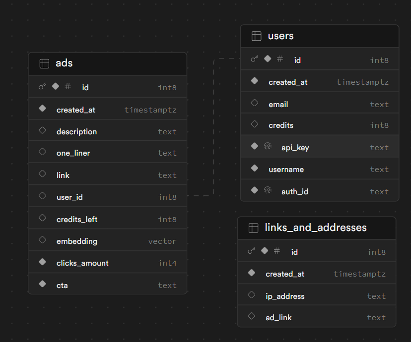

Yantar

This project was created during the Google AI Hackathon.

**Yantar** is a platform for advertisers and AI platforms.  
AI platforms generate billions of lines of text every day. At the same time, a lot of companies go bankrupt because the bills for LLMs are too high.  
That's why we created possibility to add targeted, text-based ads to your app. We used word embeddings to convert ads to vectors. Then we find the closest (semantically) ads for your AI generated text.  
This allows advertisers to show ads to their target audience, and AI platforms can get additional revenue without out-of-place advertisements.

This repo is for backend only. It works on Ubuntu 22.04.

## Installation

1. Clone the repository.

2. Update system, install all necessary libraries and tools:
    ```shell
    bash full_setup.sh
    ```
3. Set up google credentials - you need a google key file (from this tutorial: https://cloud.google.com/sdk/gcloud/reference/auth/activate-service-account)

4. Fill out .env variables using `template.env`. We used Supabase for our database. The schema of database is show below.


## Usage


1. If you want to use Docker, run the backend using scripts in `production/` folder:  
    ```shell
    cd production/
    bash network_prod.sh # Domains, reverse-proxy, SSL
    bash redis_prod.sh # Redis database for storing clicks for ads
    bash prod.sh # Backend
    ```
2. To run backend locally, you can use
    ```shell
    bash run_rest_dev.sh # Development
    bash start_backend_prod.sh # Production
    ```
You can use rest-calls.http file with REST client extension in VS Code to test out the endpoints.